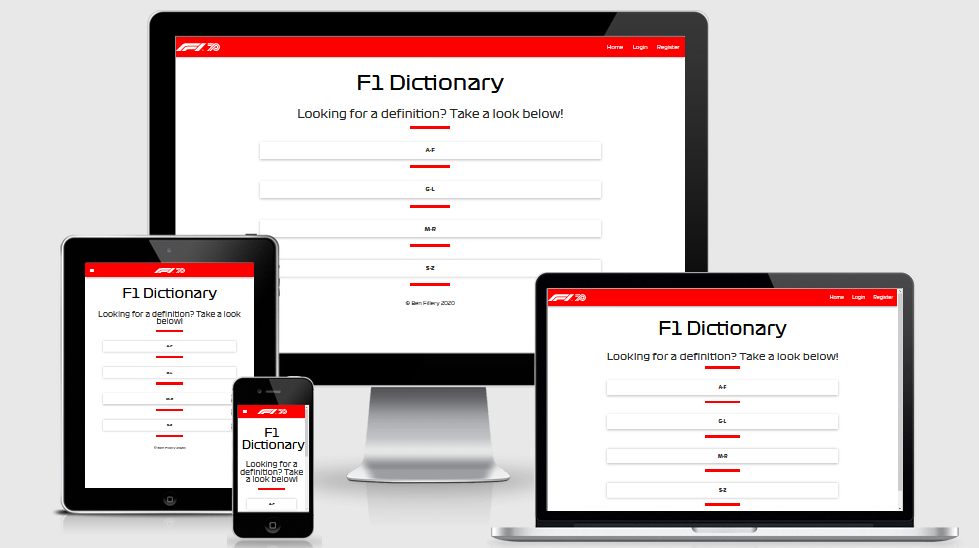

# F1 Dictionary



---

## [Project Repository](https://github.com/filleben/F1Dictionary)

## [Deployed Site](https://f1-dictionary.herokuapp.com/)

---

Formula One is a very technical sport full of complicated and unusual terms for both new and seasoned fans, which are used frequently on both social media and during race broadcasts. The goal of this project is to make an application that can display these terms with their associated definition, to hopefully increase the knowledge and understanding of fans. The project will allow users to add terms and definitions into the database, update and delete definitions.

## Table of Contents

- <a href="#ux">UX</a>
- <a href="#features">Features</a>
- <a href="#technologies">Technologies Used</a>
- <a href="#testing">Testing</a>
- <a href="#deployment">Deployment</a>
- <a href="#credits">Credits</a>

<span id="ux"></span>

## UX

### User Goals

I expect that the majority of the users will fall into the following criteria:

- Be a Formula One Fan.
- A user with very little Formula One knowledge looking to learn.
- A user with lots of Formula One knowledge looking to update and add new definitions to the site.

### User Stories

- As a user, I want the site to be simple to use and visually appealing.
- As a user, I want the definitions to be sorted in categories.
- As a user, I want to be able to update any incorrect definitions.
- As a user, I want to be able to add more definitions to the site.
- As a user, I want to be able to quickly find the information I am looking for.

### Wireframes

[Here](https://github.com/filleben/F1Dictionary/tree/master/wireframes) are the designs I made for the site.

The wireframes were made using [Balsamiq](https://balsamiq.cloud)

I made some changes from the initial wireframe design:

  - Navbar now includes the logo with the links right aligned.
  - Instead of having individual category pages, terms and definitions are displayed in an accordion.
  - I made a page containing all the terms and definitions in the database with edit and delete buttons.

### Design Choices

- **Font**: I wanted the project to look as professional as possible so decided to use a copy of the official Formula One font sourced from [Here](https://www.ffonts.net/Formula1-Display-Regular.font.download).

- **Colours**: I wanted the project to look like a product from Formula One so with this in mind I used the same colour scheme used on the [Official Site](https://www.formula1.com/). I used white (Hex: '#ffffff' RGB: 'rgb(255, 255, 255)') as the background and navbar font colour, red (Hex: '#ff0000' RGB: 'rgb(255, 0, 0)') for the navbar and block-divder elements and then black (Hex: '#000000' RGB: 'rgb(0, 0, 0)') for the body text.

<span id="features"></span>

## Features

- **Navigation bar**: Allows the user to navigate to all the pages of the site, consistent throughout the site. Links in the navbar change depending on if the user is logged in or not.
- **User Registration and Authentication**: Users have to make an account and be logged into the site in order to unlock the ability to add, edit and delete definitions.
- **Definitions Grouped by Category**: Home page displays all the different categories of definition which can be expanded on click to reveal the records in that category.
- **Add Definition**: Logged in users and add definitions to the database.
- **Edit Definitions**: Logged in users can edit existing definitions in the database and update them.
- **Delete Definitions**: Logged in users can delete definitions from the database.
- **Login Checks**: CRUD pages will only be viewable if a user is logged in.
- **404 Page**: Provides users with a message if they have entered an incorrect URL or clicked an incorrect link, gives the user the option to return to the home page.


### Features Left to Implement

- A search bar on the home page allowing users to simply search for a definition instead of manually finding it.
- Add a undo button in the event of accidental data deletion by the user.
- Further user authentication, users only allowed to change data they have entered themselves into the database.

<span id="technologies"></span>

## Technologies Used

- [HTML5](https://en.wikipedia.org/wiki/HTML5)
  - The project uses **HTML5** to provide the content and structure.

- [CSS3](https://en.wikipedia.org/wiki/Cascading_Style_Sheets)
  - The project uses **CSS3** for styling.

- [jQuery](https://jquery.com)
  - The project uses **jQuery** for interactive elements.

- [Python](https://www.python.org/)
  - The project uses **Python** to run the application.

- [Materialize](https://materializecss.com/)
  - The project uses **Materialize** for layout, responsiveness and elements.

- [Material Icons](https://materializecss.com/)
  - The project uses **Material Icons** for icons.

- [Flask](https://flask.palletsprojects.com/en/1.1.x/quickstart/)
  - The project uses **Flask** as the framework.

- [Jinja](https://jinja.palletsprojects.com/en/2.11.x/)
  - The project uses **Jinja** as the templating language.

- [MongoDB](https://cloud.mongodb.com)
  - The project uses **MongoDB** to host the database.

- [VSCode](https://code.visualstudio.com/)
  - The project developed in  **Visual Studio Code**.

- [Git](https://git-scm.com/)
  - The project uses **Git** for version control.

- [GitHub](https://github.com/)
  - The project uses **GitHub** to host the repository.

- [Heroku](www.heroku.com)
  - The project is hosted on **Heroku**.

<span id="testing"></span>

## Testing

### Testing Tools

#### I used the following tools and devices to test the website in several different scenarios. 

- [Firefox Developer Tools](https://developer.mozilla.org/en-US/docs/Tools)
  - The project used **Firefox Developer Tools** to test responsiveness, styles, and different layouts throughout development. This also allowed the site to be tested on several other [mobile devices](https://developer.mozilla.org/en-US/docs/Tools/Responsive_Design_Mode).

##### Devices I Physically Tested With. 

- [Samsung Note 10+](https://en.wikipedia.org/wiki/Samsung_Galaxy_Note_10)
  - The project used a **Samsung Note 10+** to test the site on a mobile device.

- [HP Envy x360 13](https://www.amazon.co.uk/HP-13-ar0001na-Touch-Screen-Convertible-Laptop/dp/B07V3J1H3V)
  - The project used an **HP Envy x360 13** to test the site on both a 13-inch laptop and a tablet.

##### Devices Simulated With In Firefox Dev Tools. 

- [Samsung Galaxy S9/S9+](https://en.wikipedia.org/wiki/Samsung_Galaxy_S9)

- [iPhone 6/7/8](https://en.wikipedia.org/wiki/IPhone_6)

- [iPhone X](https://en.wikipedia.org/wiki/IPhone_X)

- [iPad](https://en.wikipedia.org/wiki/IPad)


I used the following web browsers on both desktop (Windows) and mobile (Android) where available.

- [Mozilla Firefox](https://www.mozilla.org/en-GB/)
  - Desktop Version: 76.0.1 Mobile Version: 75.0.0-beta.6

- [Google Chrome](https://www.google.com/chrome/)
  - Desktop Version: 81.0.4044.138 Mobile Version: 81.0.4044.138

- [Opera](https://www.opera.com/)
  - Desktop Version: 68.0.3618.99

- [Microsoft Edge](https://www.microsoft.com/en-us/edge)
  - Desktop Version: 44.18362.449.0

The project was run through both [HTML Validation](https://validator.w3.org/) and [CSS Validation](https://jigsaw.w3.org/css-validator) with no errors found.

HTML and CSS tests carried out have been documented and visualised [here](https://github.com/filleben/F1Dictionary/tree/master/testing/site-testing.pdf)

JavaScript tests carried out have been documented and visualised [here](https://github.com/filleben/F1Dictionary/tree/master/testing/js-testing.png)

Python tests carried out have been documented and visualised [here](https://github.com/filleben/F1Dictionary/tree/master/testing/python-testing.pdf)

### User Story Tests

1. Site is simple and visually appealing:
   - The feedback I have received so far indicates that this is true.

2. Definitions sorted by categories:
   1. Go to the "Home" page.
   2. Four alphabetical categories are visible.
   3. Click on one of the categories, the corresponding definitions are now visible.
  
3. Update incorrect definitions:
   1. Go to the "Home" page.
   2. Click on "Login" to log in to your account or click on "Register" to register an account.
   3. Click on "Edit Definition".
   4. Choose the term you wish to edit and click on the "Edit" button.
   5. Make the desired changes.
   6. Click on "Update Definitions".
   7. Click on the term you updated to view the changes.

4. Add definitions to the site:
   1. Go to the "Home" page.
   2. Click on "Login" to log in to your account or click on "Register" to register an account.
   3. Click on "Add Definition".
   4. Enter the details.
   5. Click on "Add Definition".
   6. View new definition by clicking on the category you placed it in.

5. Quickly find information:
   1. Go to the "Home" page.
   2. Click on the correct category for the term you are looking for.
   3. View the terms.

### All tests performed with no errors found.

### Issues Found During Testing

- It was possible to add term and definitions into the database without providing all the required data, this was fixed by adding "required" to the relevant form elements.
- Long usernames would not render correctly on the mobile navbar, this was fixed by adding "display: block" to the .welcome-message-mbl class.

<span id="deployment"></span>

## Deployment

To deploy this page to Heroku from its [GitHub repository](https://github.com/filleben/F1Dictionary), the following steps were taken: 

1. Go to the **Heroku Dashboard** and create a **New App** with the region set to **Europe**.
2. In the **Settings** tab of your app click **Reveal Config Vars**.
3. Enter the required environment variables, **IP**, **PORT** and **MONGO_URI**.
4. Go to the **Deploy** tab and select **Heroku Git**. 
5. In your IDE of choice use the command **git push heroku master**.

Note: You will need the [Heroku CLI](https://devcenter.heroku.com/articles/heroku-command-line) downloaded and installed to push from the command line.
 
To clone this project from GitHub:

1. Under the repository name, click "Clone or download".
2. In the Clone with HTTPs section, copy the clone URL for the repository. 
3. Open your IDE of choice.
4. Change the current working directory to the location where you want the cloned directory to be made.
5. Type `` `git clone` ``, and then paste the URL you copied in Step 3.
```console
git clone https://github.com/filleben/F1Dictionary
```

6. Press Enter. Your local clone will be created.

Note: You will need to make an **env.py** file containing **MONGO_URI** for the project to connect to the database locally.

Further reading and troubleshooting on cloning a repository from GitHub can be found [here](https://help.github.com/en/articles/cloning-a-repository).

<span id="credits"></span>

## Credits

### Content

- The project uses [Materialize](https://materializecss.com/) elements.
- I used form styling sourced from [Stack Overflow](https://stackoverflow.com/questions/37127123/change-color-of-underline-input-and-label-in-materialize-css-framework-)

### Media

- The Formula 1 Logo was taken from the [Formula 1 Official Site](https://www.formula1.com/).

### Acknowledgements

- **[Paul Friel](https://github.com/Spagettileg/)** for offering guidance on implementing the Login/Register feature.
- **Gerard McBride** for helping me through the project with his advice and guidance.  